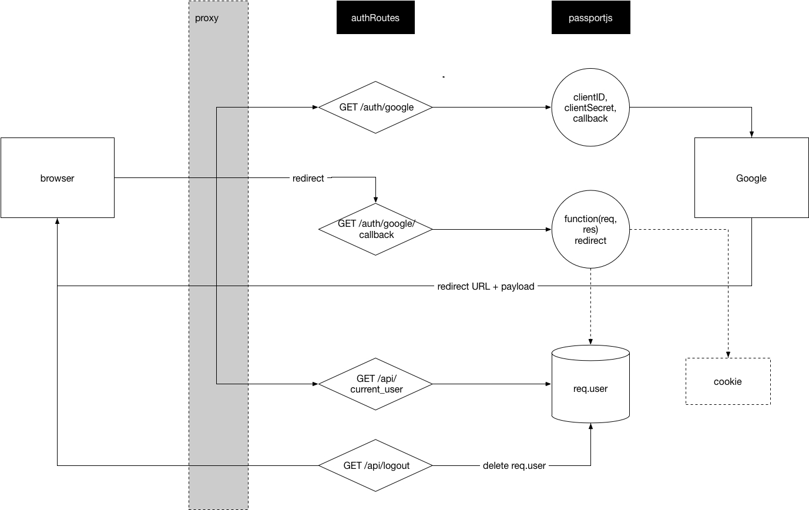

# Burger Express 

A burger edit&order web app implement by MERN stack.

## Features

* Dev & Prod Architecture
* Support Login/Logout with google account (Google+)
* Manage client side data with Redux & Redux Form
* Material Design
* Responsive

## Architecture

### Dev & Prod

### Auth Workflow

### Client Server Architecture

## TODO

* Add payment & credit features.
* Improve UI & UX.

## License

Licensed under the MIT License.
